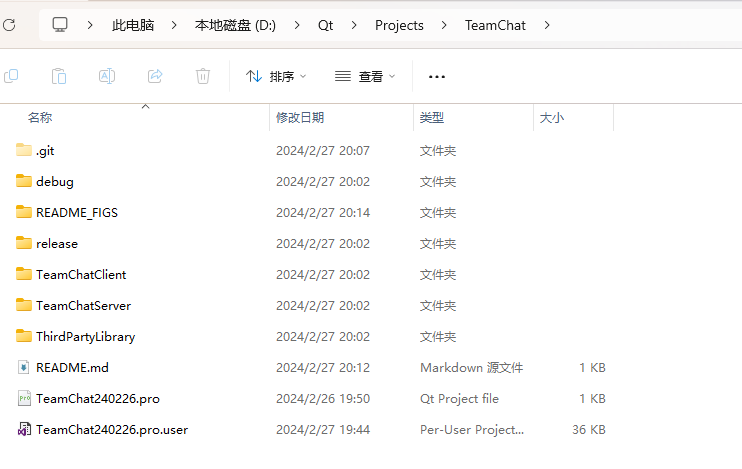

# TeamChat
基于GRPC和QFramelessWindow，使用Qt Creator开发的跨平台多功能聊天系统（正在添加...）

## 使用的第三方库
1. [QtGRPC](https://github.com/NoCaiTnT/QtGrpc)
2. [QFramelessWindow](https://github.com/NoCaiTnT/QFramelessWindow)
3. [QFramelessWindow_MSVC](https://github.com/NoCaiTnT/QFramelessWindow_MSVC)

## 特性
1. 使用的第三方库均有文档、源码、库文件
2. 不确定，再看看

## 效果图
暂无

## 环境
### Windows
1. Qt Creator 12.0.1 (Community)
2. Qt 6.6.1
3. NASM 2.16.01
4. Windows SDK 10.0.20348.0
5. MSVC 2019 64bit
6. CMake 3.27.7
7. Ninja 1.10.2
8. 需要将ThirdPartyLibrary\qwindowkit_win\qwindowkit_debug\bin添加到PATH中
9. 需要将ThirdPartyLibrary\qwindowkit_win\qwindowkit_release\bin添加到PATH中

### Linux
1. Qt Creator 12.0.1 (Community)
2. Qt 6.6.1
3. GCC 11.4.0 64bit
4. CMake 3.27.7
5. Ninja 1.10.2

## 目录结构

1. TeamChatClient：客户端源码
2. TeamChatServer：服务端源码
3. ThirdPartyLibrary：第三方库
4. debug：调试模式下的输出
5. release：发布模式下的输出
6. README_FIGS：README.md使用的图
